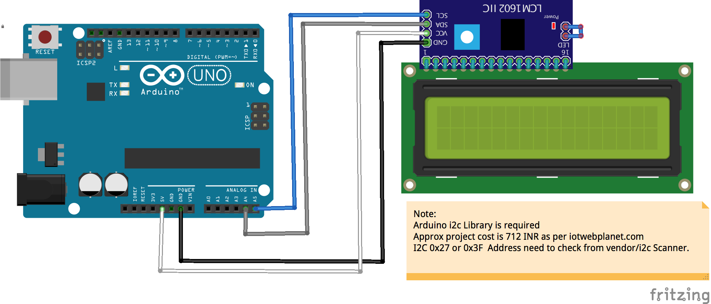

# I2C-LCD-Demo
arduino demo with i2c lcd 16x2 Display

# connection
  
  
  
 > LCD Board:   Uno Board:
 
 > SDA-        A4/SDA
 
 > SCL-        A5/SCL
 
 > GND         GND
 
 > VCC         5v
 

# try by comment and uncomment below line as per i2c address of lcd in code

  LiquidCrystal_I2C lcd(0x27,16,2);  // set the LCD address to 0x27 for a 16 chars and 2 line display

  or 

  LiquidCrystal_I2C lcd(0x3F,16,2);  // set the LCD address to 0x3F for a 16 chars and 2 line display

# some basic function of LCD library
> lcd.init();                 //for lcd intialization

> lcd.backlight();           // for lcd backlight

> lcd.setCursor(row,col);   // setting row(max 2) and col(max 16) for text 

> lcd.print("Text");       //  for printing text in lcd 

> lcd.clear();            //  for clean text of lcd 

